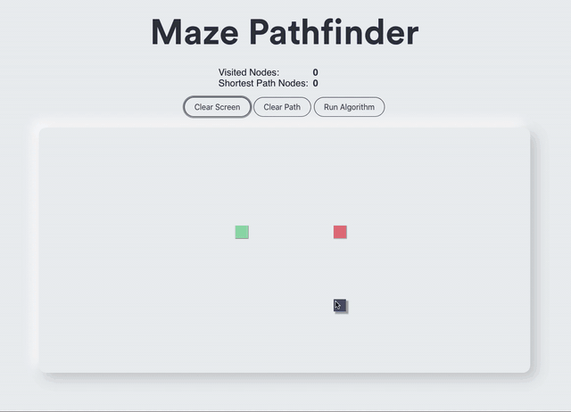
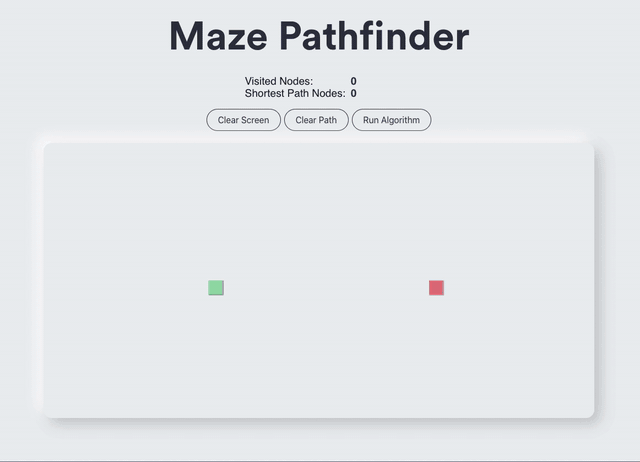
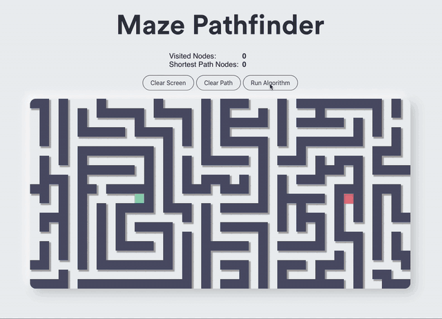
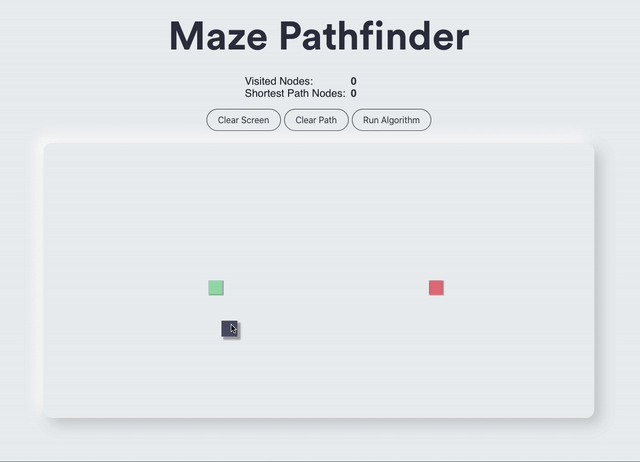

<div align="center">
 
<br><br>

[](https://app.netlify.com/sites/maze-pathfinder/deploys)

[Setup](#setup) | [Features](#features) | [Roadmap](#roadmap)

</div>

A personal project, the goal of which was to create a front-end application that would allow users to draw a maze on the screen, drag-and-drop the start and finish points, and then run a pathfinding algorithm to visually see how it methodically searches through the maze and determines the shortest path from start to finish (if one exists).

My motivation for creating this project was firstly to aid in my understanding of pathfinding algorithms. Though I was able to grasp it conceptually, I also like to see how concepts can be applied practically. Given their popularity in route planning for navigation apps, I decided a pathfinding feature within a maze drawing app would be a suitable application. This program uses _Dijkstra's algorithm_ to solve the maze. Future iterations will also include _A\*_ and _Greedy Breadth First Search_ algorithms.

Additionally, I also used this opportunity to further cement my understanding of React; in particular the use of animations and asynchronous operations. Though I did find this aspect particularly challenging to write, I find the best way to learn a new concept is to take my existing knowledge and push the boundaries of what I can create with it. After writing my millionth "React Counter App", I figured it was time to create something a little less conventional.

## Setup

This app has been deployed on Netlify, you can view it [here](https://maze-pathfinder.netlify.app/) (this app works best on Google Chrome).

If you would like to run this locally you can clone this repo and install Node.js.

After navigating into the directory, you can install the dependencies by running:

```
$ npm install
```

To starat application, run:

```
$ npm start
```

To run tests, run:

```
$ npm test
```

the application will be live on https://localhost:3000 by default.

## Features

### Setting Up

```
As a user
So that I can create a maze
I would like to be able create walls within the grid

As a user
So that I have the freedom to create any maze I want
I would like the initial grid to have no walls

As a user
So that I can create mazes quickly and easily
I would like to click and drag my mouse across the grid to create walls
```

> Users are initially presented with an empty grid with prepositioned start (green) and finish (red) nodes <br>
> They can click on an empty (white) node to turn that node into a wall <br>
> They can create a line of wall nodes by clicking, holding and dragging their cursor across the grid



```
As a user
So that I can correct myself if I make a mistake
I would like to be able to erase walls that I have created

As a user
So that I have greater flexibility in the mazes I create
I would like to be able to change the locations of the start and finish nodes
```

> If a User wishes to remove a particular wall node, they can click on it and it will be reverted back to an empty node <br>
> If they wish to change the location of the start node, they can click on it and hold and drag their cursor to its desired new position<br>
> The same applies to the finish node



### In Animation

```
As a User
So that I have an understanding of how the algorithm is searching the maze
I would like to see an animation of the grid nodes that the algorithm has searched in order

As a User
So that I can see the solution to the maze
I would like to see an animation of the shortest path that can be taken from the start node to finish node

As a User
So that I have greater context into how much of the maze needed to be searched to determine a given path
I would like to see the total number of visited nodes and the number of steps in the shortest path for a given solution
```

> When the User clicks the "Run Algorithm" button, the "visited" nodes that the algorithm has searched through are highlighted <br>
> Nodes that the algorithm has just visited are coloured dark blue <br>
> Nodes that the algorithm has visited at an earlier stage are coloured green and then eventually light blue <br>
> Once the finish node has been reached, the shortest path between the start and finish nodes is highlighted in yellow



### On Completion

```
As a User
So that I can start a new maze
I would like to be able to clear the grid of wall and visited nodes

As a User
So that I can re-run or modify an existing maze
I would like to be able to clear the grid of just the visited nodes

```

> On completion of the animation, the User is able to clear the screen with a single button click, as opposed to individually erasing each wall node <br>
> In case the User would like to re run the animation on the same maze, or make a small modification to the existing maze, there is also an option to just clear the visited and path nodes without modifying the wall nodes

### On Failure

```
As a User
So that I can see if the maze I created is unsolvable
I would like to see a notice message when trying to run the algorithm on an unsolvable maze

As a User
So that I know how to correct an unsolvable maze
I would like the notice message to provide some helpful hints on how to fix my maze
```

> If a User creates a maze that is unsolvable (that is, there is no clear path between the start and finish nodes) a notice is displayed with a helpful hint for how the User can correct their maze



## Roadmap

This project is still a work in progress, additional features I plan to add include:

- Adding more pathfinding algorithms including:
  - A\*
  - Greedy Breadth First Search
- The ability to auto generate a maze using recursive backtracking
- Adding "weighted" nodes that the algorithm could search through but would try to avoid
