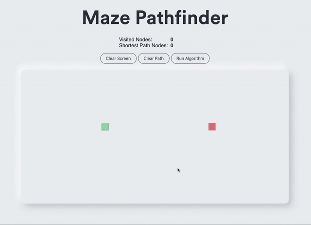

# Maze Pathfinder

A personal project, the goal of which was to create a front-end application that would allow users to draw a maze on the screen, drag-and-drop the start and finish points, and then run a pathfinding algorithm to visually see how it methodically searches through the maze and determines the shortest path from start to finish (if one exists).

My motivation for creating this project was firstly to aid in my understanding of pathfinding algorithms. Though I was able to grasp it conceptually, I also like to see how concepts can be applied practically. Given their popularity in route planning functionality within navigation apps, I decided a pathfinding feature within a maze drawing app would be a suitable application.

Additionally, I also used this opportunity to further cement my understanding of React; in particular the use of animations and asynchronous operations. Though I did find this aspect particularly challenging to write, I find the best way to learn a new concept is to take my existing knowledge and push the boundaries of what I can create with it. After writing my millionth React Counter App, I figured it was time to create something a little less conventional.

## Features

## Roadmap

This project is still a work in progress, additional features I plan to add include:

- Adding more pathfinding algorithms inlcuding:
  - A\*
  - Greedy Breadth First Search
- The ability to auto generate a maze using recursize backtracking
- Adding "weighted" nodes that the algorithm could search through but would try to avoid
